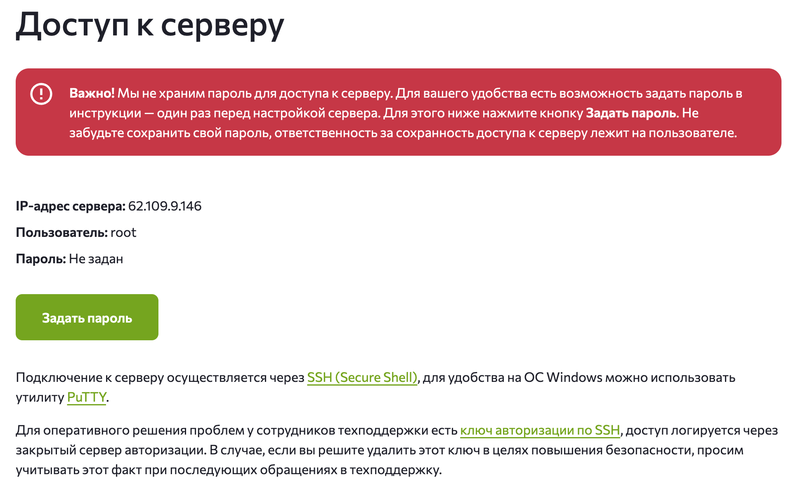
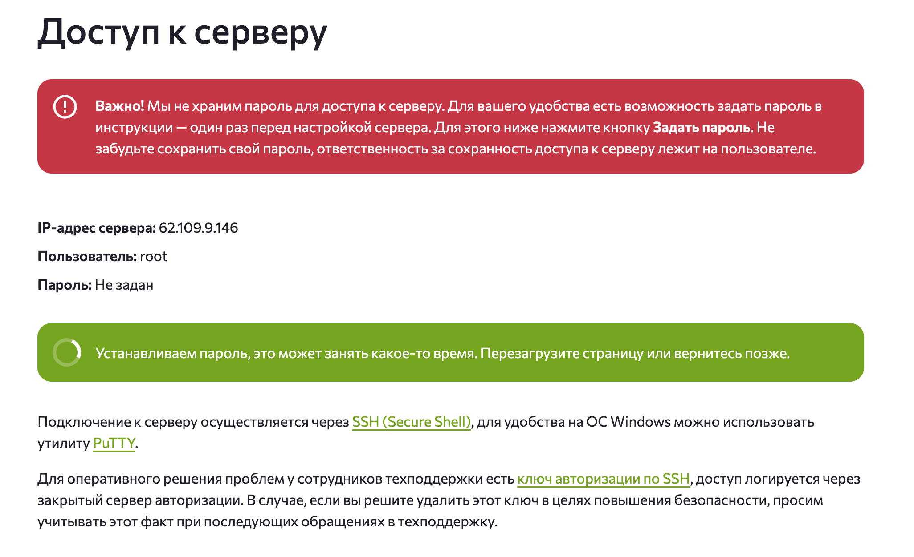

# Деплой для DE

✉️ Вопросы, обучение, консультации по Data Engineering — пиши в
личку: https://korsak0v.notion.site/Data-Engineer-185c62fdf79345eb9da9928356884ea0

💥 Аналог Notion (если не работает ссылка выше) — https://www.dataengineers.pro/mentors/korsakov-ivan

## О видео

🔥 Как Data Engineer самостоятельно поднять PostgreSQL на VDS и настроить автоматический деплой через GitHub Actions?

В этом [видео](https://youtu.be/9QX7HyQwLXI) с нуля поднимаем PostgreSQL на виртуальном сервере, подключаемся к нему
через DBeaver, запускаем базу в
Docker и затем превращаем ручной деплой в автоматический с помощью GitHub Actions и self-hosted runner.

💡 Разберём весь путь на реальном примере: от настройки SSH-ключей и создания VDS до Docker Compose, GitHub Actions,
self-hosted runner и Repository Secrets. В конце получим минимально жизнеспособный способ деплоя PostgreSQL, который
можно использовать в своих пет-проектах.

В [видео](https://youtu.be/9QX7HyQwLXI) покажу:

- как создать и настроить VDS на Ubuntu;
- как подключаться к серверу по SSH без постоянного ввода пароля;
- как поднять PostgreSQL через Docker Compose;
- как подключиться к PostgreSQL через DBeaver;
- как настроить GitHub Actions для деплоя;
- что такое self-hosted runner и как запустить его на своём VDS;
- как передавать PostgreSQL credentials через GitHub Secrets;
- как исправлять ошибки при деплое;
- как проверить, что PostgreSQL действительно работает после автоматического деплоя.

⚠️ Это не production-ready инфраструктура. Такой вариант подходит для пет-проектов и обучения, но не предназначен для
хранения персональных данных, секретов и критически важных данных.

✉️ Вопросы, обучение, консультации по Data Engineering — пиши в
личку: https://korsak0v.notion.site/Data-Engineer-185c62fdf79345eb9da9928356884ea0

💥 Аналог Notion (если не работает ссылка выше) — https://www.dataengineers.pro/mentors/korsakov-ivan

Мои соцсети и полезные ссылки:

- Mentorship/консультации по Data
  Engineering — https://korsak0v.notion.site/Data-Engineer-185c62fdf79345eb9da9928356884ea0
- TG-канал — https://t.me/DataLikeQWERTY
- Instagram — https://www.instagram.com/i__korsakov/
- Habr — https://habr.com/ru/users/k0rsakov/publications/articles/

Полезные ссылки:

- FirstVDS — https://firstvds.ru/?from=1116997
- GitHub: инструкция по созданию
  SSH-ключей — https://docs.github.com/en/authentication/connecting-to-github-with-ssh/generating-a-new-ssh-key-and-adding-it-to-the-ssh-agent
- Docker: установка Docker Engine на Ubuntu — https://docs.docker.com/engine/install/ubuntu/
- GitHub Actions: настройка self-hosted
  runner — https://docs.github.com/en/actions/how-tos/manage-runners/self-hosted-runners/configure-the-application

Мой реферальный код FirstVDS: 6481116997

Таймкоды:

- 00:00 — Вступление
- 00:18 — Настройка SSH и создание VDS
- 03:45 — Установка Docker
- 04:38 — Первый деплой PostgreSQL через docker-compose на VDS
- 07:53 — Настройка GitHub Actions
- 10:43 — Создание self-hosted runner
- 13:08 — Первый запуск GitHub Actions
- 14:18 — Docker Compose и деплой PostgreSQL
- 16:16 — GitHub Secrets
- 17:24 — Финальный деплой и проверка
- 18:18 — Заключение

#dataengineering #dataengineer #postgresql #docker #githubactions #vds #деплой #devops #sql #базыданных #petproject
#ci_cd #airflow #kafka

## О проекте

Установка пароля для VDS в разделе "_Инструкция_":

